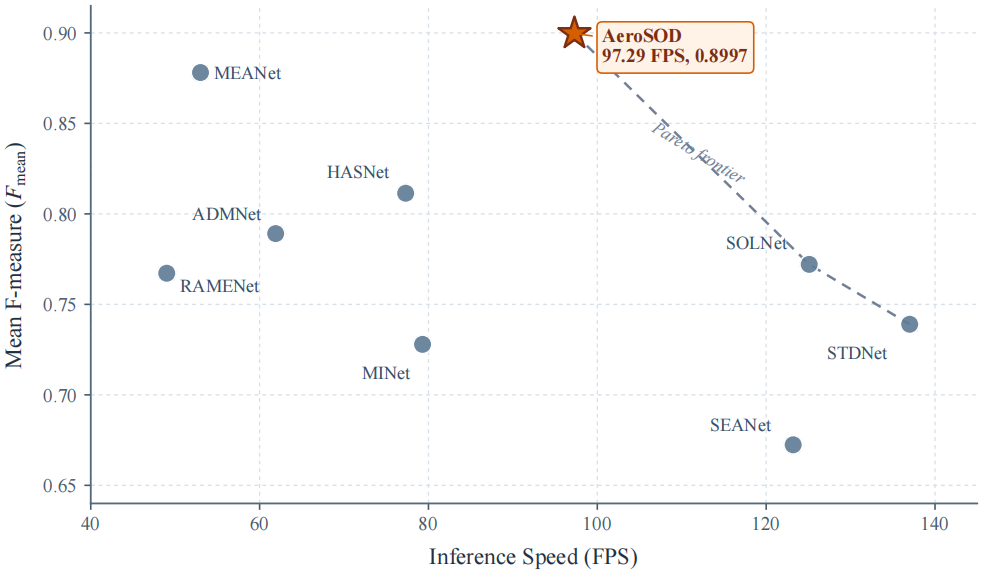
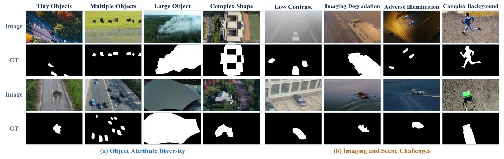

# UAVSal and AeroSOD

Official PyTorch implementation of **“UAVSal and AeroSOD: A Large-Scale Benchmark and Efficient Model for Salient Object Detection in Low-Altitude UAV Imagery.”**

Low-altitude UAV imagery contains extreme object-scale changes, cluttered backgrounds, low contrast, motion blur, and other imaging degradation. This project provides the **UAVSal** benchmark and the lightweight **AeroSOD** model for salient object detection (SOD) under these conditions.

## Contributions

- **UAVSal:** a single-modal RGB benchmark containing 5,200 low-altitude UAV image-mask pairs with pixel-level annotations.
- **AeroSOD:** an efficient SOD model built from a MobileSAMv2 TinyViT encoder, an object-aware prompt (OAP) branch, a multi-factor scene adapter (MFSA), and a scale-selective saliency query decoder (S3QD).
- **Accuracy-efficiency benchmark:** a unified comparison of accuracy, parameter count, computation, and inference speed on UAVSal.



## UAVSal Dataset

| Property        | Value                            |
| --------------- | -------------------------------- |
| Modality        | RGB low-altitude UAV imagery     |
| Annotation      | Pixel-level binary saliency mask |
| Total images    | 5,200                            |
| Training set    | 3,886                            |
| Test set        | 1,314                            |
| Mean resolution | Approximately 979 x 637          |

Organize the downloaded data as follows (image and mask files must share the same stem):

```text
data/
├── train/
│   ├── image/
│   └── mask/
└── test/
    ├── image/
    └── mask/
```




## Installation

Create a Python environment with a CUDA-compatible PyTorch installation, then install the remaining dependencies:

```bash
pip install torch torchvision ultralytics pyyaml pillow numpy imageio
```

The MobileSAMv2 source code is included under `MobileSAM/`. The following pretrained weights are required:

```text
weights/mobilesamv2/mobile_sam.pt
weights/yolo11n.pt
MobileSAM/MobileSAMv2/PromptGuidedDecoder/Prompt_guided_Mask_Decoder.pt
```

Missing MobileSAM and YOLO11n weights are downloaded automatically on first use when network access is available. The paths can be changed in `configs/default.yaml`.

## Training

Set `train_root` in `configs/default.yaml`, then run:

```bash
python train.py --config configs/default.yaml
```

## Inference and Evaluation

Set `test_root`, `checkpoint`, and `output_dir` in `configs/default.yaml`, then run:

```bash
python test.py --config configs/default.yaml
```

# 
